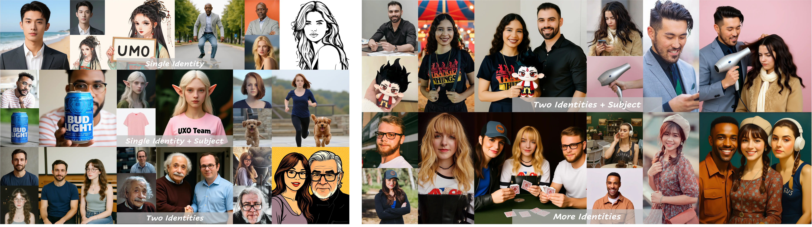

<h3 align="center">
    
    Less-to-More Generalization: </br>Unlocking More Controllability by In-Context Generation
</h3>

<p align="center"> 
<a href="https://github.com/bytedance/UNO"></a> 
<a href="https://bytedance.github.io/UNO/"></a> 
<a href="https://arxiv.org/abs/2504.02160"></a>
<a href="https://huggingface.co/bytedance-research/UNO"></a>
<a href="https://huggingface.co/datasets/bytedance-research/UNO-1M"></a>
<a href="https://huggingface.co/spaces/bytedance-research/UNO-FLUX"></a>
</p>

><p align="center"> <span style="color:#137cf3; font-family: Gill Sans">Shaojin Wu,</span><sup></sup></a>  <span style="color:#137cf3; font-family: Gill Sans">Mengqi Huang</span><sup>*</sup>,</a> <span style="color:#137cf3; font-family: Gill Sans">Wenxu Wu,</span><sup></sup></a>  <span style="color:#137cf3; font-family: Gill Sans">Yufeng Cheng,</span><sup></sup> </a>  <span style="color:#137cf3; font-family: Gill Sans">Fei Ding</span><sup>+</sup>,</a> <span style="color:#137cf3; font-family: Gill Sans">Qian He</span></a> <br> 
><span style="font-size: 16px">Intelligent Creation Team, ByteDance</span></p>

## 🔥 News
* **2025.09.12** 🔥 [UMO](https://github.com/bytedance/UMO) is here! It can freely combine one-to-many identity with any subjects in any scenarios, delivering outputs with high subject/identity consistency. You now can experience a more powerful UNO or OmniGen2 [here](https://github.com/bytedance/UMO)! You can also visit our <a href="https://bytedance.github.io/UMO/" target="_blank">project page</a> for more examples. 🔥
<div style="text-align: center; margin: 10px 0;">

<p style="font-size: 12px; font-family: 'Gill Sans', sans-serif; color: #666; margin-top: 8px;">
</p>
</div>

* **2025.08.29** 🔥 We are excited to share our new open-source project [USO](https://github.com/bytedance/USO), which can freely combine any subjects with any styles in any scenarios while ensuring photorealistic results. You can also visit our <a href="https://bytedance.github.io/USO/" target="_blank">project page</a> or try the <a href="https://huggingface.co/spaces/bytedance-research/USO" target="_blank">live demo</a> for more examples. 🔥
<div style="text-align: center; margin: 10px 0;">

<p style="font-size: 12px; font-family: 'Gill Sans', sans-serif; color: #666; margin-top: 8px;">
</p>
</div>

* **2025.08.18** ✨ We open-sourced the [UNO-1M](https://huggingface.co/datasets/bytedance-research/UNO-1M) dataset, which is a large and high-quality dataset (~1M paired images). We hope it can further benefit research.
<p align="center">

</p>

* **2025.06.26** 🎉 Congratulations! UNO has been accepted by ICCV 2025!
* **2025.04.16** 🔥 Our companion project [RealCustom](https://github.com/bytedance/RealCustom) is released.
* **2025.04.10** 🔥 Update fp8 mode as a primary low vmemory usage support. Gift for consumer-grade GPU users. The peak Vmemory usage is ~16GB now. We may try further inference optimization later.
* **2025.04.03** 🔥 The [demo](https://huggingface.co/spaces/bytedance-research/UNO-FLUX) of UNO is released.
* **2025.04.03** 🔥 The [training code](https://github.com/bytedance/UNO), [inference code](https://github.com/bytedance/UNO), and [model](https://huggingface.co/bytedance-research/UNO) of UNO are released.
* **2025.04.02** 🔥 The [project page](https://bytedance.github.io/UNO) of UNO is created.
* **2025.04.02** 🔥 The arXiv [paper](https://arxiv.org/abs/2504.02160) of UNO is released.

## 📖 Introduction
In this study, we propose a highly-consistent data synthesis pipeline to tackle this challenge. This pipeline harnesses the intrinsic in-context generation capabilities of diffusion transformers and generates high-consistency multi-subject paired data. Additionally, we introduce UNO, which consists of progressive cross-modal alignment and universal rotary position embedding. It is a multi-image conditioned subject-to-image model iteratively trained from a text-to-image model. Extensive experiments show that our method can achieve high consistency while ensuring controllability in both single-subject and multi-subject driven generation.


## ⚡️ Quick Start

### 🔧 Requirements and Installation

Install the requirements
```bash
# pip install -r requirements.txt # legacy installation command

## create a virtual environment with python >= 3.10 <= 3.12, like
# python -m venv uno_env
# source uno_env/bin/activate
# or
# conda create -n uno_env python=3.10 -y
# conda activate uno_env
# then install the requirements by you need

# !!! if you are using amd GPU/NV RTX50 series/macos MPS, you should install the correct torch version by yourself first
# !!! then run the install command
pip install -e .  # for who wanna to run the demo/inference only
pip install -e .[train]  # for who also want to train the model
```

then download checkpoints in one of the three ways:
1. Directly run the inference scripts, the checkpoints will be downloaded automatically by the `hf_hub_download` function in the code to your `$HF_HOME`(the default value is `~/.cache/huggingface`).
2. use `huggingface-cli download <repo name>` to download `black-forest-labs/FLUX.1-dev`, `xlabs-ai/xflux_text_encoders`, `openai/clip-vit-large-patch14`, `bytedance-research/UNO`, then run the inference scripts. You can just download the checkpoint in need only to speed up your set up and save your disk space. i.e. for `black-forest-labs/FLUX.1-dev` use `huggingface-cli download black-forest-labs/FLUX.1-dev flux1-dev.safetensors` and `huggingface-cli download black-forest-labs/FLUX.1-dev ae.safetensors`, ignoreing the text encoder in `black-forest-labes/FLUX.1-dev` model repo(They are here for `diffusers` call). All of the checkpoints will take 37 GB of disk space.
3. use `huggingface-cli download <repo name> --local-dir <LOCAL_DIR>` to download all the checkpoints mentioned in 2. to the directories your want. Then set the environment variable `AE`, `FLUX_DEV`(or `FLUX_DEV_FP8` if you use fp8 mode), `T5`, `CLIP`, `LORA` to the corresponding paths. Finally, run the inference scripts.
4. **If you already have some of the checkpoints**, you can set the environment variable `AE`, `FLUX_DEV`, `T5`, `CLIP`, `LORA` to the corresponding paths. Finally, run the inference scripts.

### 🌟 Gradio Demo

```bash
python app.py
```

**For low vmemory usage**, please pass the `--offload` and `--name flux-dev-fp8` args. The peak memory usage will be 16GB. Just for reference, the end2end inference time is 40s to 1min on RTX 3090 in fp8 and offload mode.

```bash
python app.py --offload --name flux-dev-fp8
```


### ✍️ Inference
Start from the examples below to explore and spark your creativity. ✨
```bash
python inference.py --prompt "A clock on the beach is under a red sun umbrella" --image_paths "assets/clock.png" --width 704 --height 704
python inference.py --prompt "The figurine is in the crystal ball" --image_paths "assets/figurine.png" "assets/crystal_ball.png" --width 704 --height 704
python inference.py --prompt "The logo is printed on the cup" --image_paths "assets/cat_cafe.png" "assets/cup.png" --width 704 --height 704
```

Optional prepreration: If you want to test the inference on dreambench at the first time, you should clone the submodule `dreambench` to download the dataset.

```bash
git submodule update --init
```
Then running the following scripts:
```bash
# inference on dreambench
## for single-subject
python inference.py --eval_json_path ./datasets/dreambench_singleip.json
## for multi-subject
python inference.py --eval_json_path ./datasets/dreambench_multiip.json
```

### 🔍 Evaluation
```bash
# evaluated on dreambench
## for single-subject
python eval/evaluate_clip_dino_score_single_subject.py --result_root <your_image_result_save_path> -save_dir <the_evaluation_result_save_path>
## for multi-subject
python eval/evaluate_clip_dino_score_multi_subject.py --result_root <your_image_result_save_path> -save_dir <the_evaluation_result_save_path>
```

### 🚄 Training
If you want to train on [UNO-1M](https://huggingface.co/datasets/bytedance-research/UNO-1M), you need to download the dataset from [HuggingFace](https://huggingface.co/datasets/bytedance-research/UNO-1M), extract and put it in ./datasets/UNO-1M. The directory will be like:
```bash
├── datasets
│   └── UNO-1M
│       ├── images
│       │   ├── split1
│       │   │   ├── object365_w1024_h1536_split_Bread_0_0_1_725x1024.png
│       │   │   ├── object365_w1024_h1536_split_Bread_0_0_2_811x1024.png
│       │   │   └── ...
│       │   └── ...
│       └── uno_1m_total_labels.json
```
Then run the training script:
```bash
# filter and format the dataset
python uno/utils/filter_uno_1m_dataset.py ./datasets/UNO-1M/uno_1m_total_labels.json ./datasets/UNO-1M/uno_1m_total_labels_convert.json 4

# train
accelerate launch train.py --train_data_json ./datasets/UNO-1M/uno_1m_total_labels_convert.json
```


### 📌 Tips and Notes
We integrate single-subject and multi-subject generation within a unified model. For single-subject scenarios, the longest side of the reference image is set to 512 by default, while for multi-subject scenarios, it is set to 320. UNO demonstrates remarkable flexibility across various aspect ratios, thanks to its training on a multi-scale dataset. Despite being trained within 512 buckets, it can handle higher resolutions, including 512, 568, and 704, among others.

UNO excels in subject-driven generation but has room for improvement in generalization due to dataset constraints. We are actively developing an enhanced model—stay tuned for updates. Your feedback is valuable, so please feel free to share any suggestions.

## 🎨 Application Scenarios
<p align="center">

</p>

<p align="center">

</p>

## 📄 Disclaimer
<p>
We open-source this project for academic research. The vast majority of images 
used in this project are either generated or licensed. If you have any concerns, 
please contact us, and we will promptly remove any inappropriate content. 
Our code is released under the Apache 2.0 License. Any used base model must adhere to the original licensing terms.
<br><br>This research aims to advance the field of generative AI. Users are free to 
create images using this tool, provided they comply with local laws and exercise 
responsible usage. The developers are not liable for any misuse of the tool by users.</p>

## 🚀 Updates
For the purpose of fostering research and the open-source community, we plan to open-source the entire project, encompassing training, inference, weights, etc. Thank you for your patience and support! 🌟
- [x] Release github repo.
- [x] Release inference code.
- [x] Release training code.
- [x] Release model checkpoints.
- [x] Release arXiv paper.
- [x] Release huggingface space demo.
- [x] Release in-context data generation pipelines (instructions provided in `./template`).
- [x] Release dataset (UNO-1M).

## Related resources

**ComfyUI**

- https://github.com/jax-explorer/ComfyUI-UNO a ComfyUI node implementation of UNO by jax-explorer.
- https://github.com/HM-RunningHub/ComfyUI_RH_UNO a ComfyUI node implementation of UNO by HM-RunningHub.
- https://github.com/ShmuelRonen/ComfyUI-UNO-Wrapper a ComfyUI node implementation of UNO by ShmuelRonen.
- https://github.com/Yuan-ManX/ComfyUI-UNO a ComfyUI node implementation of UNO by Yuan-ManX.
- https://github.com/QijiTec/ComfyUI-RED-UNO a ComfyUI node implementation of UNO by QijiTec.

We thanks the passionate community contributors, since we have reviced many requests about comfyui, but there aren't so much time to make so many adaptations by ourselves. if you wanna try our work in comfyui, you can try the above repos. Remember, they are slightly different, so you may need some trail and error to make find the best match repo for you.

##  Citation
If UNO is helpful, please help to ⭐ the repo.

If you find this project useful for your research, please consider citing our paper:
```bibtex
@article{wu2025less,
  title={Less-to-More Generalization: Unlocking More Controllability by In-Context Generation},
  author={Wu, Shaojin and Huang, Mengqi and Wu, Wenxu and Cheng, Yufeng and Ding, Fei and He, Qian},
  journal={arXiv preprint arXiv:2504.02160},
  year={2025}
}
```