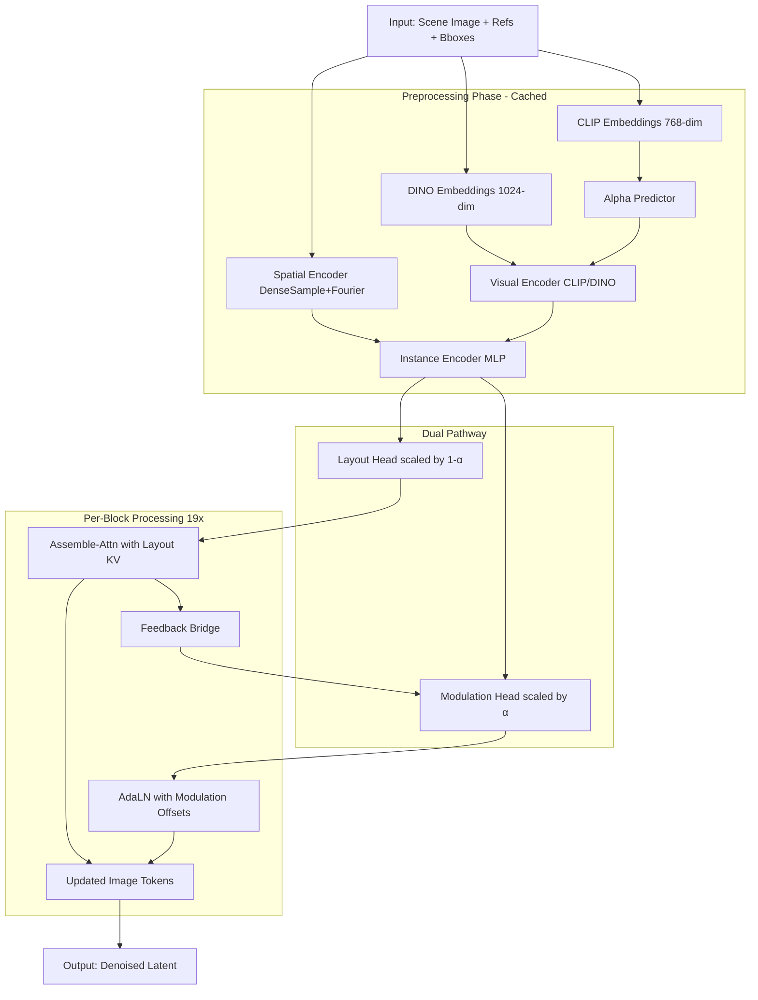

# Forward Pipeline Integration Plan

## Overview

Build a complete forward pass in [`moviepostproduction/model.py`](moviepostproduction/model.py) that orchestrates all modules to demonstrate the full inference flow. This will connect:

- Alpha predictor → Instance encoder → Layout head → Assemble-Attn
- Alpha predictor → Instance encoder → Modulation head → AdaLN offsets
- Feedback bridge between blocks (attention → modulation)

## Architecture Flow



## Key Components

### 1. Main Model Class Structure

Create `MoviePostProductionModel` class in [`moviepostproduction/model.py`](moviepostproduction/model.py) that:

- Initializes all 4 modules + feedback bridge
- Implements preprocessing phase (runs once, cached)
- Implements per-block forward pass (runs 19 times for double-stream blocks)
- Handles alpha-based routing between layout and modulation pathways

### 2. Module Integration Points

**Alpha Predictor** ([`modules/alpha_predictor.py`](moviepostproduction/modules/alpha_predictor.py)):

- Input: CLIP embedding (768) + bbox_area_ratio (1) + depth_onehot (3) = 772
- Output: alpha scalar per ref
- Already implemented and tested

**Instance Encoder** ([`modules/instance_encoder.py`](moviepostproduction/modules/instance_encoder.py)):

- Spatial: DenseSample + Fourier → 1024-dim
- Visual: CLIP (α<0.5) or DINO (α≥0.5) → 1024-dim
- Fusion MLP: concat [1024, 1024] → 3072-dim instance token
- Already implemented and tested

**Layout Head** ([`modules/layout_module.py`](moviepostproduction/modules/layout_module.py)):

- Input: instance token (3072)
- Output: layout_kv (3072) scaled by (1-α)
- Feeds into Assemble-Attn
- Already implemented via `AssembleAttentionBlock`

**Modulation Head** ([`modules/modulation_modules.py`](moviepostproduction/modules/modulation_modules.py)):

- Input: instance token (3072)
- Shared MLP → per-block projections → 12 AdaLN params per block
- Output: (batch, num_refs, 19, 12) scaled by α
- Already implemented and tested

### 3. FLUX Integration Strategy - HYBRID APPROACH

**Use Standard Diffusers FLUX + Custom Integration Layer**:

Strategy: Load pretrained `FluxTransformer2DModel` from diffusers, then wrap its forward pass with custom logic that injects modulation and layout. This keeps FLUX weights intact while adding your custom pathways.

**Minimal Dependencies to Copy**:

- `XVerse/src/flux/lora_controller.py` (26 lines) - LoRA context manager for training
- `InstanceAssemble/src/transformer_utils.py` (65 lines) - FeedForward and utilities
- Extract 3 functions from `InstanceAssemble/src/layout.py`:
  - `get_layout_idxslist()` - converts bboxes to image token indices
  - `bbox_to_mask()` - creates spatial masks
  - `get_fourier_embeds_from_boundingbox()` - fourier position encoding

**New Modules to Create**:

- `modules/feedback_bridge.py` - FeedbackBridge class
- `flux/flux_integration.py` - Custom forward wrappers that inject modulation + layout
- `data_loader.py` - Load preprocessed data

**Integration Wrappers to Add** (extend existing modules):

- In `modules/modulation_modules.py`: Add `ModulationIntegrator` class
  - Converts (batch, num_refs, 19, 12) → temb offsets for FLUX
  - Handles spatial expansion (ref → tokens inside bbox)
  - Applies alpha scaling
- In `modules/layout_module.py`: Add `LayoutIntegrator` class
  - Manages img_idxs_list_list creation
  - Orchestrates AssembleAttentionAddon calls
  - Handles alpha scaling (1-α)

### 4. Forward Pass Implementation

**Preprocessing Phase** (runs once, cached):

```python
# 1. Load data from prepare_synthetic_dataset.py output
# 2. For each ref:
#    - Load CLIP embedding (768-dim)
#    - Compute bbox_area_ratio
#    - Get depth_onehot from depth_label
#    - Run alpha_predictor → alpha
#    - Encode spatial features (DenseSample + Fourier) → 1024
#    - Encode visual features (CLIP if α<0.5, DINO if α≥0.5) → 1024
#    - Fuse via instance_encoder → instance_token (3072)
# 3. Run layout_head → layout_kv (3072) × 50 refs
# 4. Run modulation_head → adaln_offsets (batch, 50, 19, 12)
# 5. Create bbox masks for spatial gating
# 6. Create img_idxs_list for each bbox
```

**Per-Block Forward** (19 double-stream blocks):

```python
for block_idx in range(19):
    # 1. Prepare modulation offsets: adaln_offsets[:, :, block_idx, :] → delta_emb
    # 2. Add feedback from previous block (if block_idx > 0 and FG refs)
    # 3. Call XVerse's block_forward() with delta_emb, delta_emb_cblock
    #    - This applies modulation to AdaLN: norm1_forward/norm1_context_forward
    #    - Runs attention with modulated normalization
    #    - Runs FFN with modulated normalization
    # 4. After block forward, run Assemble-Attn addon:
    #    - AssembleAttentionAddon(instance_tokens, image_tokens, img_idxs_list, alpha)
    #    - Updates image tokens inside bbox regions via layout pathway
    # 5. Compute feedback for next block:
    #    - Mean-pool updated image tokens inside bbox (FG refs only)
    #    - Pass through FeedbackBridge → feedback_offsets
    # 6. Continue to next block
```

**After 19 Double-Stream Blocks** (38 single-stream blocks):

```python
for block_idx in range(38):
    # Run single_block_forward() with modulation (light, FG only)
    # No Assemble-Attn in single blocks (layout pathway inactive)
```

### 5. Implementation Strategy - HYBRID APPROACH

**Step 1: Copy Minimal Dependencies**

- Copy `lora_controller.py` from XVerse → `flux/lora_controller.py`
- Copy `transformer_utils.py` from InstanceAssemble → `flux/transformer_utils.py`
- Extract 3 layout functions → `flux/layout_utils.py`
- Create `flux/__init__.py`

**Step 2: Extend Existing Modules with Integration Wrappers**

- Add `ModulationIntegrator` to `modules/modulation_modules.py`:
  - Takes ModulationHead output + alpha + img_idxs_list
  - Converts to temb offsets that can be added to FLUX's timestep embeddings
  - Handles ref-to-token expansion and alpha scaling
- Add `LayoutIntegrator` to `modules/layout_module.py`:
  - Wraps AssembleAttentionAddon with img_idxs_list management
  - Handles alpha scaling and spatial gating
  - Returns updated image tokens

**Step 3: Create New Modules**

- `modules/feedback_bridge.py`: FeedbackBridge class (zero-init Linear)
- `flux/flux_integration.py`: Custom forward wrapper for FLUX blocks
- `data_loader.py`: Load embeddings and metadata

**Step 4: Build Main Pipeline**

- `model.py`: MoviePostProductionModel class
  - Load standard FLUX: `FluxTransformer2DModel.from_pretrained()`
  - Initialize all custom modules
  - `preprocess()`: compute cached tensors
  - `forward()`: wrap FLUX forward with custom injection logic
  - `__main__`: demo with real data

### 6. Simplified Modulation Injection (No XVerse Complexity)

**Key Insight**: We don't need XVerse's complex delta_emb format. We can directly modify FLUX's AdaLN behavior.

**FLUX's AdaLayerNormZero** does:

```python
emb = block.norm1.linear(block.norm1.silu(temb))  # (batch, 3072) → (batch, 18432)
shift_msa, scale_msa, gate_msa, shift_mlp, scale_mlp, gate_mlp = emb.chunk(6, dim=-1)  # 6 × (batch, 3072)
norm_hidden = block.norm1.norm(hidden_states) * (1 + scale_msa) + shift_msa
```

**Our ModulationIntegrator** will:

1. Take ModulationHead output: (batch, num_refs, 12) for current block
2. Split into 6 img params + 6 txt params
3. For each ref, apply params to tokens inside bbox:

   - Direct modification: `shift_msa[bbox_tokens] += our_shift × α`
   - Direct modification: `scale_msa[bbox_tokens] += our_scale × α`
   - Direct modification: `gate_msa[bbox_tokens] *= our_gate × α`

4. This is simpler than XVerse's delta_emb and achieves the same effect

**Implementation**: Create a wrapper that intercepts the AdaLN output and adds our offsets before normalization is applied.

### 7. Testing Strategy

Create runnable demo in `__main__` block:

- Load 1 sample from `output_data/` (images, captions, CLIP/DINO embeddings)
- Initialize model with all modules
- Run preprocessing: alpha prediction → instance encoding → layout/modulation heads
- Run forward pass through 19 double-stream blocks
- Print tensor shapes at each stage
- Verify alpha routing works (check which refs go through which pathway)
- Verify spatial gating (check image tokens outside bbox unchanged)
- Print feedback bridge activations (should be zero initially)

## Summary - What Gets Built

**Minimal file copying** (~120 lines from XVerse/InstanceAssemble):

- `lora_controller.py` - for LoRA training capability
- `transformer_utils.py` - FeedForward utilities
- `layout_utils.py` - 3 bbox/spatial functions

**New integration code** (your custom logic):

- `ModulationIntegrator` class - converts your ModulationHead output to FLUX AdaLN offsets
- `LayoutIntegrator` class - orchestrates your AssembleAttentionAddon with FLUX
- `FeedbackBridge` module - connects layout → modulation between blocks
- `flux_integration.py` - wrapper that injects custom logic into standard FLUX
- `data_loader.py` - loads preprocessed embeddings
- `model.py` - main pipeline that ties everything together

**Result**: Clean integration where:

- Your `layout_module.py` and `modulation_modules.py` remain the source of truth
- Standard FLUX transformer loads pretrained weights
- Custom logic injected via wrappers, not by forking FLUX
- Ready for training with LoRA support

## Key Technical Details

**Dimensions**:

- FLUX hidden dim: 3072
- Image tokens: 8192 (128×128 latent)
- Text tokens: ~154 (T5 + CLIP)
- Instance token: 3072
- Layout KV: 3072 per ref
- AdaLN params: 12 per block (6 img + 6 txt)

**Alpha Routing**:

- α < 0.5 (BG/MG): layout weight = (1-α) → high, modulation weight = α → low
- α ≥ 0.5 (FG): layout weight = (1-α) → low, modulation weight = α → high

**Spatial Gating**:

- Layout: hard binary mask on attention (only Q tokens inside bbox)
- Modulation: soft mask on normalized features (multiply by bbox mask after AdaLN)

**Feedback Flow**:

- Block N Assemble-Attn output → mean pool inside bbox → Linear(3072→3072)
- Add to Block N+1 modulation offset (FG refs only)
- Zero init ensures no effect at start

## Files to Create/Modify

### Copy from existing codebases (minimal, ~120 lines total):

1. **Copy** `XVerse/src/flux/lora_controller.py` → `flux/lora_controller.py` (26 lines)
2. **Copy** `InstanceAssemble/src/transformer_utils.py` → `flux/transformer_utils.py` (65 lines)
3. **Extract** 3 functions from `InstanceAssemble/src/layout.py` → `flux/layout_utils.py` (~30 lines)

### Create new files:

4. **Create** `flux/__init__.py` - package init
5. **Create** `flux/flux_integration.py` - custom forward wrapper for FLUX blocks
6. **Create** `modules/feedback_bridge.py` - FeedbackBridge module
7. **Create** `data_loader.py` - data loading utilities

### Extend existing modules (add wrapper classes):

8. **Extend** `modules/modulation_modules.py` - add `ModulationIntegrator` class
9. **Extend** `modules/layout_module.py` - add `LayoutIntegrator` class

### Build main pipeline:

10. **Build** `model.py` - MoviePostProductionModel with full forward pass

## Detailed Integration Design

### ModulationIntegrator Class (add to modulation_modules.py)

**Purpose**: Convert ModulationHead output to FLUX-compatible temb offsets

**Input**:

- `adaln_offsets`: (batch, num_refs, 19, 12) from ModulationHead
- `alpha`: (batch, num_refs) alpha values
- `img_idxs_list_list`: List[List[Tensor]] - which image tokens per bbox
- `text_ids`: (batch, num_refs, 3) - text token positions per ref
- `block_idx`: current block index

**Output**:

- `temb_offset_img`: (batch, num_img_tokens, 3072) - offset for image stream AdaLN
- `temb_offset_txt`: (batch, num_txt_tokens, 3072) - offset for text stream AdaLN

**Logic**:

1. Extract block slice: `adaln_offsets[:, :, block_idx, :]` → (batch, num_refs, 12)
2. Split: img_params (6), txt_params (6)
3. Scale by alpha: img_params × α, txt_params × α
4. Expand spatially:

   - For each ref, assign img_params to image tokens in img_idxs_list[ref]
   - For each ref, assign txt_params to text token at text_ids[ref]

5. Convert 6 params to 3072-dim offset (reconstruct what AdaLN would chunk)
6. Add feedback offset if provided

### LayoutIntegrator Class (add to layout_module.py)

**Purpose**: Orchestrate AssembleAttentionAddon with proper spatial gating

**Input**:

- `instance_tokens`: (batch, num_refs, 3072)
- `image_tokens`: (batch, num_img_tokens, 3072) - from FLUX block output
- `alpha`: (batch, num_refs)
- `bboxes`: (batch, num_refs, 4) - normalized coordinates
- `latent_hw`: (H, W) - latent dimensions (128, 128)

**Output**:

- `updated_image_tokens`: (batch, num_img_tokens, 3072)
- `layout_summary`: (batch, num_refs, 3072) - for feedback computation

**Logic**:

1. Create img_idxs_list_list from bboxes using `get_layout_idxslist()`
2. Scale instance_tokens by (1-α)
3. Call AssembleAttentionAddon (already implemented)
4. Return updated tokens + mean-pooled bbox features

### FeedbackBridge Module (new file)

**Purpose**: Connect layout output to next block's modulation

**Architecture**:

```python
class FeedbackBridge(nn.Module):
    def __init__(self, dim=3072, num_blocks=19):
        self.projections = nn.ModuleList([
            nn.Linear(dim, dim, bias=True) for _ in range(num_blocks)
        ])
        # Zero init
        for proj in self.projections:
            nn.init.zeros_(proj.weight)
            nn.init.zeros_(proj.bias)
    
    def forward(self, layout_summary, alpha, block_idx):
        # layout_summary: (batch, num_refs, 3072)
        # Only process FG refs (alpha >= 0.5)
        fg_mask = (alpha >= 0.5).unsqueeze(-1)
        feedback = self.projections[block_idx](layout_summary)
        feedback = feedback * fg_mask  # Zero out BG/MG refs
        return feedback  # (batch, num_refs, 3072)
```

## Custom Forward Pass Logic

The `flux_integration.py` will provide a wrapper that:

```python
def custom_flux_forward(
    flux_transformer,  # Standard diffusers FluxTransformer2DModel
    hidden_states,     # Image latents
    encoder_hidden_states,  # Text embeddings
    temb,              # Timestep embedding
    # Custom inputs:
    instance_tokens,   # (batch, num_refs, 3072)
    alpha,             # (batch, num_refs)
    bboxes,            # (batch, num_refs, 4)
    modulation_integrator,
    layout_integrator,
    feedback_bridge,
):
    # Preprocessing (once per denoising step)
    img_idxs_list_list = layout_integrator.create_img_idxs_list(bboxes, latent_hw=(128, 128))
    feedback_offsets = [None] * 19  # Storage for feedback between blocks
    
    # Double-stream blocks (19x)
    for block_idx in range(19):
        block = flux_transformer.transformer_blocks[block_idx]
        
        # 1. Modulation: modify temb before AdaLN
        temb_mod = modulation_integrator.apply_offsets(
            temb, instance_tokens, alpha, img_idxs_list_list, 
            block_idx, feedback_offsets[block_idx]
        )
        
        # 2. Run standard FLUX block with modified temb
        # Monkey-patch: temporarily replace block's norm layers to use temb_mod
        hidden_states, encoder_hidden_states = run_flux_block_with_custom_temb(
            block, hidden_states, encoder_hidden_states, temb_mod, ...
        )
        
        # 3. Layout: inject AssembleAttentionAddon after attention
        hidden_states, layout_summary = layout_integrator.apply_layout(
            hidden_states, instance_tokens, alpha, img_idxs_list_list
        )
        
        # 4. Compute feedback for next block
        if block_idx < 18:
            feedback_offsets[block_idx + 1] = feedback_bridge(
                layout_summary, alpha, block_idx
            )
    
    # Single-stream blocks (38x) - modulation only, no layout
    for block_idx in range(38):
        block = flux_transformer.single_transformer_blocks[block_idx]
        # Run with light modulation (FG only)
        hidden_states = run_single_block_with_modulation(...)
    
    return hidden_states
```

## Success Criteria

- Uses standard `FluxTransformer2DModel.from_pretrained("black-forest-labs/FLUX.1-dev")`
- Forward pass runs end-to-end without modifying FLUX source
- All tensor shapes match FLUX specs (3072 dim, 8192 image tokens, 154 text tokens)
- Alpha routing works: FG refs (α≥0.5) get strong modulation, BG refs get strong layout
- Spatial gating confines effects to bbox regions
- Feedback bridge connects blocks (zero initially, learns during training)
- LoRA controller ready for training phase
- Demo runs with real data from `output_data/`