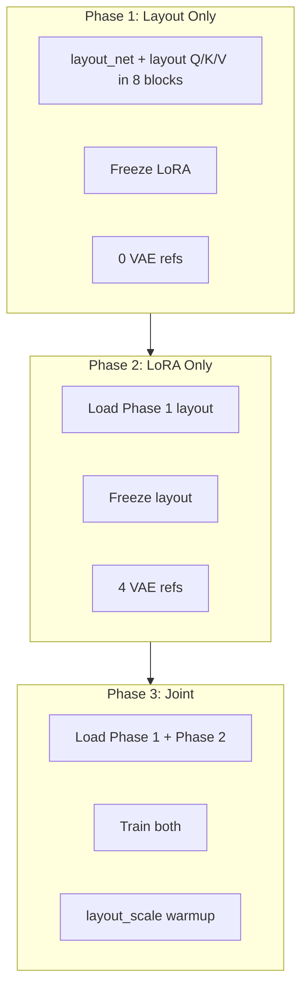

# UNO Layout Fixes, Staged Training, and TensorBoard Logging

## Summary

Apply the fixes documented in [ps1_layoutfix.md](UNO/updates_mds/ps1_layoutfix.md) and [ps2_stagedtraining.md](UNO/updates_mds/ps2_stagedtraining.md) to the UNO codebase, and add proper TensorBoard logging for training visibility.

---

## 1. Layout Fixes in Layers ([uno/flux/modules/layers.py](UNO/uno/flux/modules/layers.py))

### 1a. DoubleStreamBlock and SingleStreamBlock `__init__` (Bugs 1, 4)

- Add `self.num_layout_heads = 8`
- Add `self.layout_mod = Modulation(hidden_size, double=False)`
- Add Q/K/V small-scale init (ps2): `nn.init.normal_(self.layout_q.weight, std=0.02)`, `nn.init.zeros_(self.layout_q.bias)`, same for layout_k and layout_v

### 1b. Layout Cross-Attention Logic (Bugs 1, 2, 4) — both blocks

Replace the current single-query attention (lines 331–368 in DoubleStreamBlock, 359–406 in SingleStreamBlock) with:

- **Bug 1 fix**: Bidirectional multi-head attention — use ALL tokens `[obj | region]` as queries so each region pixel gets a distinct output `[R, hs]`, not a cloned single vector
- **Bug 2 fix**: Density map — accumulate `density_map` via `scatter_add_` for each write, then normalize: `hidden_states_add = hidden_states_add / density_map.clamp(min=1.0)` before adding to `img`
- **Bug 4 fix**: AdaLayerNorm modulation — apply `layout_mod(vec[i:i+1])` to get scale/shift/gate; use `context_norm = (1 + scale) * layout_norm(context) + shift` and gate the output deltas

### 1c. `img_idxs_list` Indexing Fix

The ps1 full replacement uses `img_idxs_list[i][j]` — current code uses `img_idxs_list[i]` then indexes `[j]`; verify compatibility. The model passes `img_idxs_list = [lk["img_idxs_list"]]`, so `i` is batch index (0 for bsz=1). The `valid` loop yields `(i, j)` from `layout_masks`; the check `i >= len(img_idxs_list)` should use the structure where `img_idxs_list[i]` is the per-batch list. The layout returns `img_idxs_list` as `list` of length `max_objs`; when wrapped as `[lk["img_idxs_list"]]`, we have `img_idxs_list[0]` = that list. So `img_idxs_list[i][j]` = `img_idxs_list[0][j]` for object j. The ps1 replacement uses `img_idxs_list[i][j]` — correct. Add the bounds check `if i >= len(img_idxs_list) or j >= len(img_idxs_list[i])` as in ps1.

---

## 2. TrainArgs and Training Loop ([train_hybrid.py](UNO/train_hybrid.py))

### 2a. TrainArgs Updates (ps1 + ps2)

Add/update:

- `grounding_ratio: float = 0.3` (from 0.4)
- `layout_scale: float = 1.5` (from 1.0)
- `layout_warmup_steps: int = 2000` (ps1) or `1000` (ps2 phase3)
- `training_phase: int = 3` (1, 2, or 3)
- `phase1_ckpt: str | None = None`
- `phase2_ckpt: str | None = None`
- `layout_lr_multiplier: float = 2.0` (Phase 1) / `0.3` (Phase 3)
- `layout_double_blocks: list[int] | None = [0, 2, 4, 6, 8, 10, 12]` (default for phase 1/3)
- `layout_single_blocks: list[int] | None = [0]`

### 2b. Phase Setup Function `setup_phase(args, dit, logger)`

Replace the current optimizer/param-group setup (lines 172–209) with a `setup_phase` function that:

- **Phase 1**: Train only layout params (layout_net + layout Q/K/V/out/norm/mod in blocks `[0,2,4,6,8,10,12]` double + `[0]` single). Freeze LoRA. `max_vae_refs=0`.
- **Phase 2**: Load `phase1_ckpt`. Train only LoRA. Freeze layout. Pass `layout_kwargs=None`.
- **Phase 3**: Load `phase1_ckpt` + `phase2_ckpt`. Train both. Use `layout_lr_multiplier=0.3` for layout params.

### 2c. Training Loop Changes

- **current_step_ratio**: Phase 1 → always `0.0` (layout fires every forward); else `random.uniform(0.0, 1.0)`
- **layout_kw**: Phase 2 → `None`; else `inp.get("layout_kwargs")`
- **effective_layout_scale**: Phase 3 and `global_step < layout_warmup_steps` → ramp from 0 to target; else use `args.layout_scale`
- **max_vae_refs**: Phase 1 → 0; Phase 2/3 → 4 (from dataset)
- Pass `effective_layout_scale` and `layout_kw` into `dit(...)`

### 2d. Checkpoint Saving (Phase-Aware)

- Phase 1: Save only layout keys (`layout_net`, `layout_q`, `layout_k`, `layout_v`, `layout_out`, `layout_norm`, `layout_mod`)
- Phase 2: Save only LoRA keys
- Phase 3: Save both layout and LoRA keys

---

## 3. Dataset ([uno/dataset/dense_layout.py](UNO/uno/dataset/dense_layout.py))

### 3a. `max_vae_refs` Parameter (ps2)

- Add `max_vae_refs: int = 5` to `__init__`
- Replace `self.MAX_VAE_REFS` with `self.max_vae_refs` in `__getitem__`

### 3b. VAE Crop Resize (Bug 6 — ps1)

- Add `resize_and_pad_ref(img, target_size=320)`: resize so long edge = target_size (preserve aspect), then pad to square using existing `pad_to_size`
- Replace `pad_to_size(crop, self.REF_SIZE, self.REF_SIZE)` with `resize_and_pad_ref(crop, self.REF_SIZE)` for both VAE and CLIP crops

---

## 4. Phase Configs

Create three config files:

- **configs/phase1_layout.json** — Phase 1: layout-only, 0 VAE refs, 5k steps, layout blocks [0,2,4,6,8,10,12] double + [0] single
- **configs/phase2_vae.json** — Phase 2: LoRA-only, 4 VAE refs, 8k steps, `phase1_ckpt` path
- **configs/phase3_joint.json** — Phase 3: joint, 4 VAE refs, 15k steps, `phase1_ckpt` and `phase2_ckpt` paths, `layout_warmup_steps=1000`, `layout_lr_multiplier=0.3`

---

## 5. TensorBoard Logging Enhancements

Extend logging in [train_hybrid.py](UNO/train_hybrid.py) to track:

| Metric | When | Purpose |
|--------|------|---------|
| `train/loss` | Every sync step | Primary loss |
| `train/learning_rate` | Every sync step | LR tracking |
| `train/layout_scale` | Every sync step (when layout active) | Effective layout scale (phase 3 warmup) |
| `train/phase` | Logged once at start | Phase (1/2/3) for context |
| `train/grad_norm` | Every sync step (optional) | Gradient magnitude |
| `gen`, `target`, `gen_with_layout`, `path_a_refs`, `path_b_refs` | Every `log_image_freq` | Existing image logging |

Add:

```python
if tb_writer and accelerator.sync_gradients:
    tb_writer.add_scalar("train/loss", train_loss_accum, global_step)
    tb_writer.add_scalar("train/learning_rate", lr_scheduler.get_last_lr()[0], global_step)
    if args.training_phase in (1, 3) and layout active:
        tb_writer.add_scalar("train/layout_scale", effective_layout_scale, global_step)
```

Use `tb_writer.add_scalars` or namespaced scalar names (e.g. `train/loss`) for clarity. Add grad norm only if cheap (e.g. `torch.nn.utils.clip_grad_norm_` already computes it — we can log it).

---

## 6. Model Checkpoint Loading

Ensure `load_file` from safetensors is used for `phase1_ckpt` and `phase2_ckpt` in `setup_phase`, with `strict=False` since we load partial state.

---

## File Change Summary

| File | Changes |
|------|---------|
| `uno/flux/modules/layers.py` | Bidirectional layout attention, density map, layout_mod, num_layout_heads, Q/K/V init in DoubleStreamBlock and SingleStreamBlock |
| `train_hybrid.py` | TrainArgs, setup_phase, phase-aware loop, checkpoint logic, TensorBoard metrics |
| `uno/dataset/dense_layout.py` | resize_and_pad_ref, max_vae_refs param |
| `configs/phase1_layout.json` | New |
| `configs/phase2_vae.json` | New |
| `configs/phase3_joint.json` | New |
| `run_phases.sh` | New — bash script to run Phase 1 → 2 → 3 sequentially |

---

## 7. Bash Script to Run All 3 Phases

Create **`run_phases.sh`** in the UNO root to execute the three phases sequentially:

```bash
#!/bin/bash
set -e

SCRIPT_DIR="$(cd "$(dirname "${BASH_SOURCE[0]}")" && pwd)"
cd "$SCRIPT_DIR"

PHASE1_CKPT="log/phase1/checkpoint-5000/hybrid_lora_layout.safetensors"
PHASE2_CKPT="log/phase2/checkpoint-8000/hybrid_lora_layout.safetensors"

echo "=== Phase 1: Layout only (5k steps) ==="
python train_hybrid.py --config configs/phase1_layout.json

echo "=== Phase 2: LoRA only (8k steps) ==="
python train_hybrid.py --config configs/phase2_vae.json

echo "=== Phase 3: Joint fine-tuning (15k steps) ==="
python train_hybrid.py --config configs/phase3_joint.json

echo "=== All 3 phases complete ==="
echo "Phase 1 logs: log/phase1"
echo "Phase 2 logs: log/phase2"
echo "Phase 3 logs: log/phase3"
echo "TensorBoard: tensorboard --logdir log"
```

The phase configs must reference the correct checkpoint paths (e.g. `phase2_vae.json` uses `phase1_ckpt: "log/phase1/checkpoint-5000/hybrid_lora_layout.safetensors"`). Phase 1 saves to `log/phase1`, Phase 2 to `log/phase2`, Phase 3 to `log/phase3`. Run `tensorboard --logdir log` to view all phases in one UI.

---

## Architecture Note


